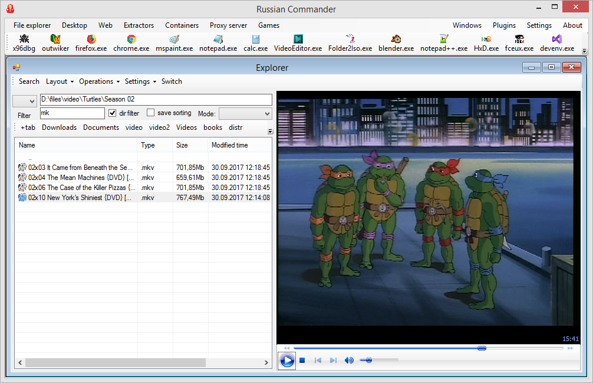

# Commander
Yet another file commander.

Containers, tags, extractors and navigation.

**Project progress: 30%**

# References:
* https://github.com/flagbug/YoutubeExtractor (MIT/GPLv2)
* https://www.codeproject.com/Articles/22012/Explorer-Shell-Context-Menu (CPOL License)
* https://github.com/Telavian/DjvuNet (MIT)

# Useful references:
* https://www.codeproject.com/Articles/11505/NGif-Animated-GIF-Encoder-for-NET 
* http://kbyte.ru/ru/Programming/Articles.aspx?id=66&mode=art