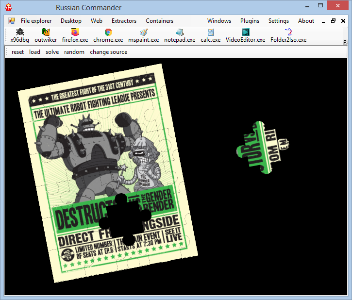

# Tag Commander

Organize your files via tags and other metadata (using NTFS [Forks](https://en.wikipedia.org/wiki/Fork_(file_system)) (Alternate data stream (ADS)))

https://www.filemeta.org/Manifesto.html

Containers, tags, extractors and navigation. 

**Some features:**
1. Organize your files into tag groups for quick access
2. Preview your files (images, videos, music, pdf, djvu, gifs, webp)
3. Monitor disk space consumption with scanner
4. Url bookmarks with search
5. Quick access to your favorite applications
6. Tabs for quick access to favorite directories
7. Backup your tag groups with iso-image
8. Files deduplication
9. Plugins
10. Games (via plugin) 

# File previewer

# Scanner

Also available as a separate tool : https://github.com/fel88/Scanner

# Youtube downloader 

You can install yt-dlp from here: https://github.com/yt-dlp/yt-dlp/releases

Also available as a separate tool :https://github.com/fel88/YoutubeDownloader

# Games  

# References:
* https://www.nuget.org/packages/Trinet.Core.IO.Ntfs
* https://github.com/flagbug/YoutubeExtractor (MIT/GPLv2)
* https://www.codeproject.com/Articles/22012/Explorer-Shell-Context-Menu (CPOL License)
* https://github.com/Telavian/DjvuNet (MIT)
* https://github.com/pvginkel/PdfiumViewer (Apache-2.0)
* https://github.com/DiscUtils/DiscUtils (MIT)
* https://github.com/yt-dlp/yt-dlp

# Useful references:
* https://www.codeproject.com/Articles/11505/NGif-Animated-GIF-Encoder-for-NET 
* http://kbyte.ru/ru/Programming/Articles.aspx?id=66&mode=art
* https://www.codeproject.com/Articles/93301/Implementing-a-Multithreaded-HTTP-HTTPS-Debugging
* http://www.steffengerlach.de/freeware/
* https://github.com/webmproject/libwebp

Some icons by [Yusuke Kamiyamane](http://p.yusukekamiyamane.com/). Licensed under a [Creative Commons Attribution 3.0 License](http://creativecommons.org/licenses/by/3.0/)
